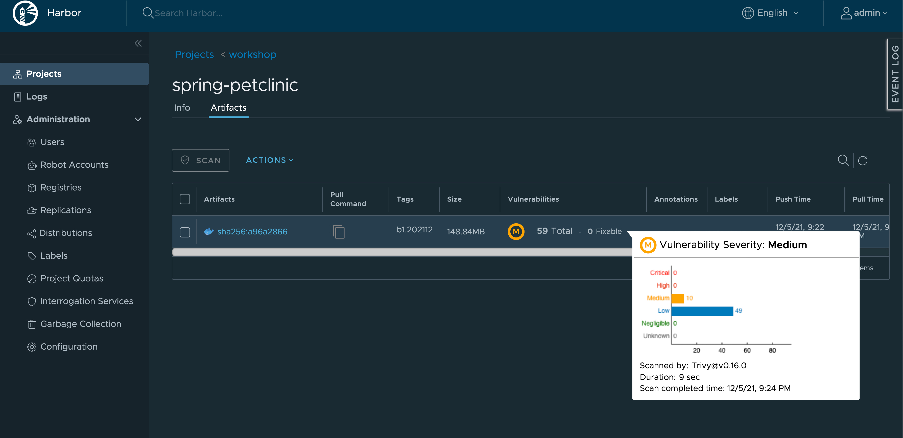

# TKG Standalone Labs 

In this lab, we will deploy Tanzu Kubernetes Grid to vSphere, AWS, or Azure.  We will additionally deploy TKG packages for ingress, container registry services.

OSS Signed and Supported Packages:

- **Contour** for ingress
- **Cert-manager** for certificate management
- **Harbor** for image registry


## Required CLIs

- kubectl
- tanzu v1.4.0
- [yq v4.12+](https://github.com/mikefarah/yq) (to install use `brew` for Mac and `apt-get` for Linux).
- kind (helpful, but not required)
- ytt, kapp, imgpkg, kbld (bundled with tkg)

## Setup Environment Step by Step
### Setup Environment Variable for params.yaml


>Note: The labs depend on a master `params.yaml` file that is used for environment specific configuration data.  A sample `REDACTED-params.yaml` file is included at the root of this repo, named REDACTED-params.yaml.  It is recommended you copy this file and rename it to params.yaml and place it in the `local-config/` directory, and then start making your adjustments.  `local-config/` is included in the `.gitignore` so your version won't be included in an any future commits you have to the repo.


Set the PARAMS_YAML environment variable to the path of your `params.yaml` file.  If you followed the recommendation, the value would be `local-config/params.yaml`, however you may choose otherwise.  This may be the case if you are using multiple `params.yaml` files in the case of AWS and vSphere deployments.

```bash
# Update the the path from the default if you have a different params.yaml file name or location.
export PARAMS_YAML=local-config/params.yaml
```

### Prepare a Tanzu Standalone Cluster via TCE

>Note: Follow the [official docs](https://docs.vmware.com/en/VMware-Tanzu-Kubernetes-Grid/1.4/vmware-tanzu-kubernetes-grid-14/GUID-install-cli.html) for background and pre-requisite tasks, which includes downloading tanzu cli and kubectl cli from my.vmware.com and links for docker setup.  Although not required, it is helpful to have the [kind](https://github.com/kubernetes-sigs/kind) cli installed.

### 1. [Install a Standalone Cluster]

### 1.1a On local host, follow UI configuration

```bash
tanzu standalone-cluster create --ui
```
### 1.1b On AWS

>Note: It is expected that you already have the `aws` cli and that you've gone through the `aws configure` process to establish local credential auth on your workstation.

1. Once this is complete, we need to:

You need first to generate SSH Public Key with your aws account to access cluster Node if necessary later for trouble shooting. If you follow scripts, The private key will be stored in the `keys` directory.

```bash
./scripts/01-prep-aws-objects.sh
```

2. Deploy a standalone cluster from a Configuration File

The script below will copy a template configuration file for AWS from this lab, and then replace the values with the specific configuration found in your `$PARAMS_YAML` file. Run this script to complete the deployment.

```bash
./scripts/02-deploy-aws-mgmt-cluster.sh
```

3. Post Deployment Configuration

At this point the standalone cluster is deployed.  The following script will perform some optional actions.

```bash
./scripts/03-post-deploy-standalone-cluster.sh
```

4. Validation Step. Check standalone cluster is provisioned, pods are running:

```bash
kubectl get pods -A
```

### 2. [Install Tanzu Standard Addons ]

We will leverages common components that were used by most test cases. Below listed all components will be installed to our standalone cluster

- cert-manager for self signed certs required by contour and Harbor
- contour for L7 Loadbalancer
- [optional] external-dns
- Harbor 

### 2.1 prepare tanzu-standard package repository

We need to add `tanzu-standard` package repository to access common components we shall install. 

```bash
tanzu package repository add tanzu-standard --url projects.registry.vmware.com/tkg/packages/standard/repo:v1.4.0  --namespace tanzu-kapp --create-namespace
```

To verify that added common package repository is `Reconcile` successfully.

```bash
tanzu package repository list -A


NAME            REPOSITORY                                                                  STATUS               DETAILS  NAMESPACE
  tanzu-standard  projects.registry.vmware.com/tkg/packages/standard/repo:v1.4.0              Reconcile succeeded                   tanzu-kapp
  tanzu-core      projects.registry.vmware.com/tkg/packages/core/repo:v1.21.2_vmware.1-tkg.1  Reconcile succeeded           tkg-system
```

### 2.2 Install cert-manage package

To install `cert-manager`, the following script will perform some optional actions.

```bash
./scripts/04-deploy-cert-manager.sh
```

### 2.3 Setup cert-manage clusterissuer for Contour 

To install `cert-manager`, the following script will perform some optional actions.

```bash
./scripts/05-apply-cluster-issuer-selfsigned.sh
```

Verify `clusterissuer` is installed.

```bash
kubectl get clusterissuer

NAME                        READY   AGE
selfsigned-cluster-issuer   True    35s
```

### 2.4 Install Contour 

To install `Contour`, the following script will perform some optional actions.

```bash
./scripts/06-deploy-contour.sh
```

To verify contour is installed successfully, check below command output

```bash
kubectl get svc -A


tanzu-system-ingress   envoy                  LoadBalancer   100.67.100.205   a8ecee570f62949c1ae1f159f5ed103a-67068714.us-west-2.elb.amazonaws.com   80:32716/TCP,443:32531/TCP   4m7s
```

### 2.5 Install Harbor with selfsigned certificate

To install `Harbor`, you simply need to follow below script. 


>Note: For my script, I leverage aws route53 DNS server to resolve Harbor homepage URL. You could simply leverage IP address but you need to replace Harbor clusterissuer selfsign yaml with your public access IPs. If you are leverging public signed Harbor certificate, you must first login to Route53 to prepare a `CNAME` record with domain set to someting like `*.YOURCLUSTER.tkg-aws-e2-lab.winterfell.be`

```bash
./scripts/07-deploy-harbor-with-selfsign.sh
```

You should be able to access `Harbor` via below URL, with `username: admin` and `password` in your `params.yaml` 

```bash
https://harbor.dragonstone.tkg-aws-e2-lab.winterfell.be/
```




### Cleaning UP. [Clean up your environment ]

```bash
./scripts/99-clean-all.sh
```


## TAP Installation Labs Scripts

The following labs can be run to deploy TAP.

#### [Deploy Tanzu Application Platform beta 0.4.0-build.12](docs/tap.md)